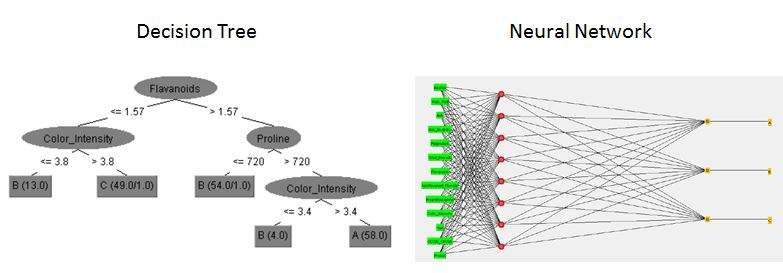
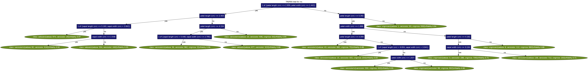

# TREPAN in Python

A Python implementation of **TREPAN**, the algorithm of Mark Craven and Jude Shavlik
for extracting a comprehensible decision tree from a trained neural network (or any
other black-box classifier) by querying it.

* Craven & Shavlik (1995), *Extracting Tree-Structured Representations of Trained
  Networks*, NeurIPS 8 — [`docs/papers/craven-shavlik-1995-nips.pdf`](docs/papers/craven-shavlik-1995-nips.pdf)
* Craven (1996), *Extracting Comprehensible Models from Trained Neural Networks*,
  PhD thesis, University of Wisconsin–Madison — [`docs/papers/craven-1996-thesis.pdf`](docs/papers/craven-1996-thesis.pdf)

The implementation follows the thesis (the most detailed description of the
algorithm) and notes where the NeurIPS paper differs. See
[`docs/ALGORITHM.md`](docs/ALGORITHM.md) for a section-by-section mapping from the
papers to the code, including the few places where an interpretation had to be made.



## How TREPAN works

TREPAN treats rule extraction as an inductive learning problem. The target concept is
the function computed by the network, and the network itself is the **oracle** that
labels any instance we care to ask about. Because the oracle can be queried, the tree
never has to be built from a few training examples: every decision rests on at least
`min_sample` instances.

1. **Membership queries.** The oracle labels the training examples (the tree
   approximates the network, not the data) and every synthetic *query instance*.
2. **Instance model.** Query instances are drawn from a model of the data
   distribution: empirical frequencies for discrete features and Gaussian kernel
   density estimates with width `1/sqrt(m)` for continuous ones. Models are estimated
   *locally*: a node fits its own model when the examples reaching it differ
   significantly (χ² / Kolmogorov–Smirnov tests, Bonferroni corrected) from those
   behind the nearest ancestor model.
3. **Constrained sampling (`DrawInstance`).** Instances for a node must satisfy the
   tests on its path. Binary constraints become per-feature bounds; for an m-of-n
   constraint, literals are chosen at random (proportionally to how likely they are)
   and forced until the test is guaranteed.
4. **m-of-n splits.** The best binary test (information gain) seeds a beam search
   (width 2) with the operators *m-of-n+1* and *m+1-of-n+1*. An operator application
   is admitted only if it partitions the instances significantly differently (χ²
   test) and scores better than the worst test in the beam; a literal-pruning pass
   simplifies the result. A feature may not appear in two m-of-n tests on one path.
5. **Best-first expansion.** Nodes are expanded in order of
   `f(N) = reach(N) · (1 − fidelity(N))`, the estimated share of instances whose
   classification the tree can still improve.
6. **Stopping.** A node is a leaf when it covers instances of one class with high
   probability: all of at least `m_L = z²_δ (1 − ε) / ε` instances agree. Growth stops
   at `max_internal_nodes`. Optionally a validation set picks the best tree from the
   nested sequence, and subtrees whose leaves all predict one class are collapsed.

## Installation

```bash
git clone https://github.com/AImenes/TREPAN.git
cd TREPAN
pip install -e ".[examples,dev]"      # core needs only numpy and scipy
```

Rendering trees to PNG needs the Graphviz `dot` binary (`apt install graphviz`,
`brew install graphviz`); the DOT source is written regardless.

## Usage

```python
from sklearn.datasets import load_iris
from sklearn.neural_network import MLPClassifier
from sklearn.pipeline import make_pipeline
from sklearn.preprocessing import StandardScaler

from trepan import Trepan

iris = load_iris(as_frame=True)
network = make_pipeline(StandardScaler(), MLPClassifier((16, 12), max_iter=5000, random_state=0))
network.fit(iris.data, iris.target)

tree = Trepan(network, min_sample=1000, max_internal_nodes=15, random_state=0)
tree.fit(iris.data)                       # only X is needed: the oracle provides the labels

print(tree.export_text(class_names=iris.target_names))
print("fidelity to the network:", tree.fidelity(iris.data))
tree.to_graphviz(class_names=iris.target_names).render("iris_tree", format="png")
```

Anything with a scikit-learn style `predict(X)` method, or a plain callable mapping a
2-D array to labels, can be the oracle: a scikit-learn pipeline, a PyTorch module
(see [`examples/torch_models.py`](examples/torch_models.py)), an ensemble, a nearest
neighbour classifier. Nominal features must be integer-coded and listed in
`categorical_features` (by index, or by name for a DataFrame).

A tree extracted from a two-hidden-layer network on the Iris data (13 internal nodes,
test-set fidelity 0.97):

```
if 1 of {petal length (cm) <= 2.959, petal width (cm) <= 1.442}:
    if petal length (cm) <= 2.403:
        if 1 of {sepal length (cm) <= 5.163, sepal width (cm) > 2.842}:
            class: setosa  [setosa: 974, versicolor: 26]
        ...
else:
    if petal length (cm) <= 5.392:
        ...
    else:
        class: virginica  [setosa: 1, versicolor: 63, virginica: 936]
```



The counts in brackets are the oracle's labels for the training examples and query
instances that reached the leaf. Regions far from the data (where the network is
probed only through synthetic queries) are often impure; that is the network's own
behaviour there, faithfully reported.

### Examples

```bash
python examples/run_iris.py                                   # MLP oracle on Iris
python examples/run_heart.py --validation-fraction 0.1        # Cleveland heart disease, 8 nominal features
python examples/run_heart.py --help                           # all options
```

Both scripts print the tree, accuracy and fidelity, and write DOT and PNG files to
`examples/output/`. With the thesis' validation-set selection the heart tree collapses
to a single m-of-n test with test-set fidelity 0.84:

```
if 3 of {sex != 0, cp == 0, oldpeak > 1.676, slope != 2, ca != 0, thal == 3}:
    class: no disease  [no disease: 923, disease: 77]
else:
    class: disease  [no disease: 46, disease: 954]
```

## Parameters

| Parameter | Default | Paper / thesis | Meaning |
|---|---|---|---|
| `max_internal_nodes` | 15 | 15 / 31 | Global stopping criterion. |
| `min_sample` | 1000 | 1000 / 10 000 | Instances (examples + queries) before any decision at a node. |
| `epsilon`, `delta` | 0.05, 0.05 | 0.05, 0.05 / –, 0.01 | Local stopping criterion `prob(p_c < 1 − ε) < δ`. |
| `stopping_rule` | `"strict"` | thesis | `"strict"`: all of ≥ `m_L` instances agree. `"interval"`: lower confidence bound on `p_c` reaches `1 − ε`. |
| `criterion` | `"gain"` | gain ratio / gain | Split scoring. |
| `beam_width` | 2 | – / 2 | Beam of the m-of-n search; 1 is hill climbing. |
| `split_significance` | 0.05 | – / 0.05 | χ² admissibility test for operator applications; `None` disables. |
| `max_literals` | `None` | – | Cap on the literals of one test. |
| `distribution_test_alpha` | 0.10 | – / 0.10 | Level of the local-model test (Bonferroni corrected). |
| `kde_bandwidth` | `"craven"` | 1/√m | Kernel width: `range/√m`; also `"silverman"`, `"scott"` or a number. |
| `validation_fraction` | `None` | – / 0.10 | Hold-out share used to pick the best nested tree. |
| `prune` | `True` | thesis | Collapse same-class subtrees. |
| `random_state` | `None` | | Seed for reproducible sampling. |

All parameters are documented in the `Trepan` docstring (`help(trepan.Trepan)`).

## Fitted attributes

`root_` (the tree, a `Node` with `split`, `children`, `constraints`, `class_counts`,
`reach`, `fidelity`), `n_internal_nodes_`, `n_leaves_`, `depth_`,
`n_feature_references_`, `n_generated_instances_`, `n_oracle_queries_`,
`expansion_order_`, `validation_fidelity_curve_`, `n_pruned_nodes_`, `classes_`,
`feature_names_`. Methods: `predict`, `apply` (leaf ids), `fidelity`, `score`,
`export_text`, `export_dot`, `to_graphviz`.

## Project layout

```
trepan/
  core.py       Trepan estimator: best-first expansion, stopping criteria, validation selection
  oracle.py     Oracle wrapper (membership queries, counting, DataFrame pass-through)
  sampling.py   Instance models (empirical / KDE), local-model test, DrawInstance
  search.py     ConstructTest / ConstructMofNTest: beam search, χ² admissibility, literal pruning
  splits.py     Literal, MofNTest, Constraint, information gain, candidate thresholds
  stopping.py   Confidence bounds and m_L for the local stopping criterion
  tree.py       Node, text / DOT export, redundant-subtree pruning
examples/       run_iris.py, run_heart.py, torch_models.py
tests/          pytest suite
docs/           ALGORITHM.md, the two papers, images
data/           heart.csv (Cleveland heart disease)
```

## Development

```bash
pip install -e ".[dev]"
pytest
ruff check trepan tests examples && ruff format --check trepan tests examples
```

## References

* M. W. Craven and J. W. Shavlik. Extracting tree-structured representations of trained
  networks. *Advances in Neural Information Processing Systems 8*, pp. 24–30, 1996.
* M. W. Craven. *Extracting Comprehensible Models from Trained Neural Networks*. PhD
  thesis, University of Wisconsin–Madison, 1996.
* P. M. Murphy and M. J. Pazzani. ID2-of-3: Constructive induction of M-of-N concepts
  for discriminators in decision trees. *ICML 1991*.
* J. R. Quinlan. *C4.5: Programs for Machine Learning*. Morgan Kaufmann, 1993.
* B. W. Silverman. *Density Estimation for Statistics and Data Analysis*. Chapman and
  Hall, 1986.
