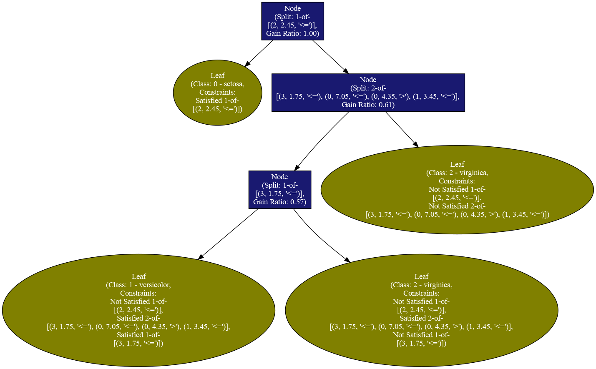

# TREPAN Implementation in Python

This repository hosts a Python implementation of the TREPAN algorithm.

Detailed information about the algorithm can be found in the [original paper](https://proceedings.neurips.cc/paper_files/paper/1995/file/45f31d16b1058d586fc3be7207b58053-Paper.pdf). For more comprehensive understanding and application details, please refer to [Mark Craven's thesis](https://biostat.wisc.edu/~craven/papers/thesis.pdf).

## Execution Instructions

The current implementation does not include a stopping criteria with `prob(p_c < (1 - epsilon)) < delta`. Instead, we implemented a cutoff value for `p_c`.

To execute the program, use the following command: `python run_continuous.py`.

After execution, the resulting decision tree is saved as 'trepan_tree.png' in your working directory.

## Sample Output

The sample output provided below is a decision tree derived from the Iris Dataset, utilizing an Oracle defined as an Artificial Neural Network (ANN) with two hidden layers. Remarkably, the fidelity score of this tree with respect to the specific ANN is 100%.

## Installation Requirements

The implementation is built using Python 3.9 within a Conda environment. The required libraries are as follows:

- Math
- NumPy
- Pandas
- itertools
- PyTorch
- scikit-learn
- Graphviz

To ensure accurate replication of results, please ensure all libraries are correctly installed in your Python environment.

